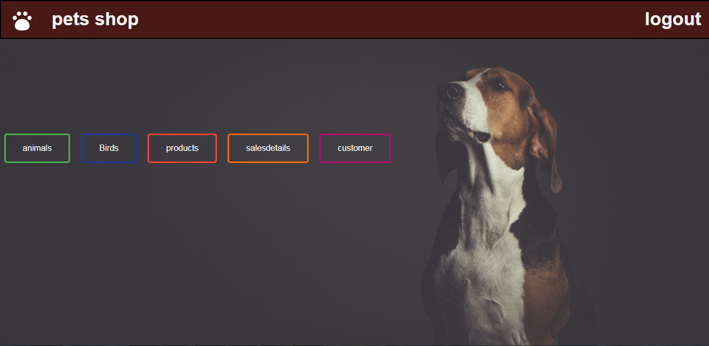

# **Pet Shop** :dog: :cat:

Um mini sistema de gerenciamento de banco de dados que ajuda o proprietário de uma petshop de pequena escala a acompanhar os pets disponíveis e seus produtos, juntamente com os detalhes de vendas de sua loja.
 
# Objetivos :muscle:

 
- Fornecer uma interface baseada na web para um proprietário de petshop gerenciar suas atividades de petshop.

- Fornecer uma opção para armazenar e gerenciar as informações básicas sobre pets e produtos para pets na loja.

- Fornecer uma opção para armazenar e gerenciar os detalhes de vendas da loja.

- Fornecer uma opção para armazenar e gerenciar as informações básicas sobre o cliente.

- Acompanhar as informações sobre pets e produtos vendidos para um cliente.

# Desenvolvido com

**HTML** **CSS** **PHP** **MYSQL**

# Descrição :pencil:

Relatório completo <a href="./report/Full report.pdf">visualizar </a>

## Capturas de tela :wink:

- Página de login

   

- Página inicial

  

# Como executar?

1. Baixe o projeto

2. Crie um novo banco de dados chamado "petshop_management" no MySQL e importe o arquivo petshop_management.sql

3. Altere o usuário e a senha para a conexão com o banco de dados em cada arquivo PHP, de acordo com o servidor que você está usando

4. Página de login: Usuário = "abcd"
   Senha = 123

Obrigada :smiley:
